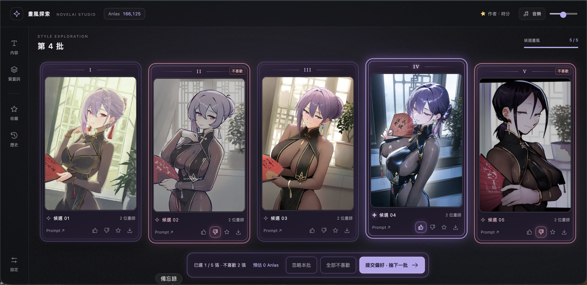

從 52,266 位畫師中探索組合，透過喜歡／不喜歡學習偏好，找出你的 NovelAI 畫風。

# NovelAI 畫風探索



[開始遊玩](https://nightsay2002.github.io/novelai-style-evolver/) · 作者：[時分](https://github.com/NightSay2002)

## 使用方法

1. 在「設定」填入自己的 NAI Persistent API Token。
2. 調整內容 Prompt、Negative Prompt、質量詞及生成設定。
3. 可按「輸入畫師起點」貼上畫師名稱或 NAI 畫師串；輸入權重會被忽略，各畫師改抽 0.1–2.0 隨機權重，未知名稱亦可使用。套用後欄位改寫成實際使用的正規 Prompt，每位起始偏好 +1。
4. 抽五張圖，點卡框或讚好選取，可多選。沒有基準時，首次提交以第一張讚好的圖建立起點。之後只有「設為目前最佳／比基準更好」才更換基準。
5. 星星收藏可作儲存點。「從此繼續」還原當時學習、Prompt、設定、參考圖及自選畫師，並以該收藏為基準，不額外計勝負。

只隨機調整畫師組合及權重，質量詞固定。點圖片可放大；倒讚表示不喜歡，「忽略本批」可跳過。右下角「重新開始探索」可重設進度。

目前最佳可刪除；刪除只移除圖片基準，仍沿用它的畫師組合，下一次提交讚好可建立新基準。「重新開始探索」會保留自選畫師起點及已抽出的權重，偏好重新由每位 +1 開始。

有起始組合後，每批 **1 張大幅調權＋3 張新增／替換畫師＋1 張全新探索**；最多 6 位，權重 0.1–2.0。替換繼承原位置權重，其餘不變；排除同設定最近 50 批的組合，高分候選抽過後改選其他畫師。固定項目或資料不足時可能無法變動。只有明確晉升才更換最佳基準，沿用舊圖、不多生成。

第三、四批至少 2 位畫師，第五批起至少 3 位。基準人數不足時，偏好候選先新增畫師補到門檻，達標後再照上述規則變動；資料池不足時例外。

未選 −1、不喜歡 −3 保留為圖片記分；學習比較整組差異，不再向每位畫師重複加減分。只比較同設定圖片；有可比基準時「全部不喜歡」表示五張都不如基準。「忽略」只記 −1、不學習勝負。左側「排名」顯示相對偏好與比較依據，不是勝率。

## 本機執行

不需安裝前端依賴，在專案根目錄執行：

```bash
python3 -m http.server 8080
```

開啟 [localhost:8080](http://localhost:8080/)。`npm run check` 檢查程式；`npm run benchmark` 比較模擬算法；[隔離 UI 測試](http://localhost:8080/test/ui-smoke.html) 不呼叫 NAI，也不讀寫正式資料。

## 注意

- 每人使用自己的 NAI Token；生成費用以 NAI 實際計費為準。
- 設定、圖片、偏好及收藏只保存在目前瀏覽器；清除網站資料會遺失，線上版與本機版不共用。
- 歷史與收藏各上限 50 張；內容與設定修改從下一批生效。
- 新版學習從中立開始，不刪圖片與收藏；舊儲存點缺少新版學習時會提示。組合分數只是估計，模擬結果不代表真實出圖品質保證。
- 隨附 52,266 位 Gelbooru 畫師；介面門檻預設 150、最低 50 且不設上限。自選畫師只加入目前探索，不修改共用資料。使用資料不需 Gelbooru／Danbooru 金鑰；只有重新收集才需依 `.env.example` 設定本機 `.env`，不要上傳金鑰。
- 純靜態網站，GitHub Pages 從 `main` 根目錄發布，無後端。

參考 [novelai-image-static](https://github.com/NightSay2002/novelai-image-static)（WTFPL v2）；標籤來源：Gelbooru、Danbooru。
